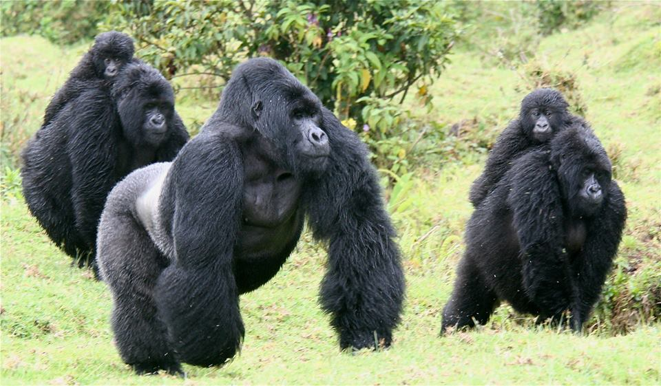

[Back](../tourprograms.md)

4 Days Low Land Gorillas Tour in Kahuzi Biega National Park

Day 1: Arrive at Kigali airport in Rwanda. You will be welcomed by our company safari guide who will transfer you to your hotel – Briefing and Overnight in Kigali.

Day 2: After breakfast at Kigali you will be transferred to Bukavu in Congo the capital city of the South Kivu Province- arrival late in the Afternoon and Transfer at orchides Hotel for you overnight

Day 3 : After early Breakfast – transfer by our tourist car to the National Park to begin the trekking. Trekking for 2 to 3 hours in mountainous jungle area of Kahuzi Biega National Park, to find the large lowland gorilla family. The species here are Eastern Lowland Gorilla, very different from the more famous Mountain Gorillas found in the Virunga National Park. Unlike the chimpanzee-like lowland gorillas found in Gabon and Congo Brazzaville, The Kahuzi Biega gorillas are large, about the size of the mountain gorilla, so you definitely won’t be disappointed. Late in the afternoon you will be transferred to your hotel in Bukavu.

Day 4: Back To Kigali or Transfer To Goma For Nyiragongo Hiking.

[Back](../tourprograms.md)
