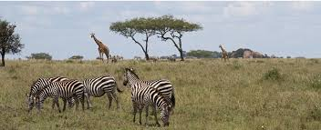
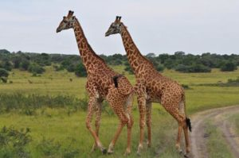
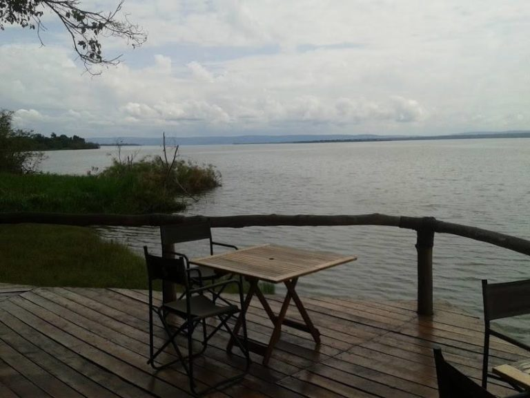

[Back](../tourprograms.md)

2 Days Akagera Wildlife Tour in Rwanda

Day 1: Arrive at Akagera National 

You will drive to the east of Rwanda to Akagera National Park after being briefed about your safari. You will have an afternoon game drive in the park and you will be able to see a variety of birds and animals such as elephant, giraffe, buffalo, spotted hyena, hippo, and crocodiles. Dinner and overnight at Akagera Safari Lodge.

Day 2: Canoe Ride/ Game Drive

After breakfast, you either go for a morning game drive in the park again or a canoe ride on Lake Ihema to see the large number of hippo, the huge Nile crocodile and birds. Later proceed back to Kigali.

[Back](../tourprograms.md)

